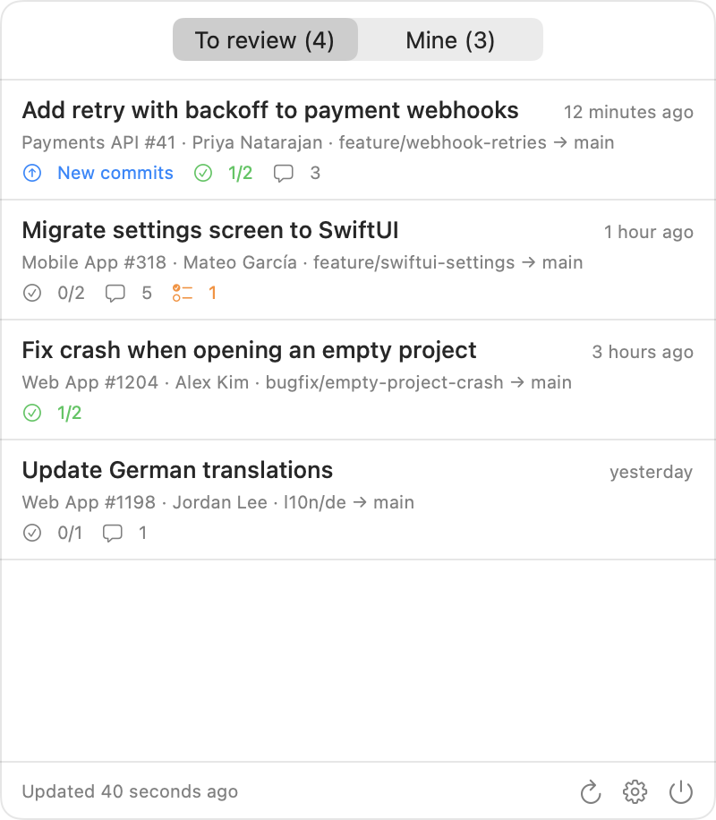
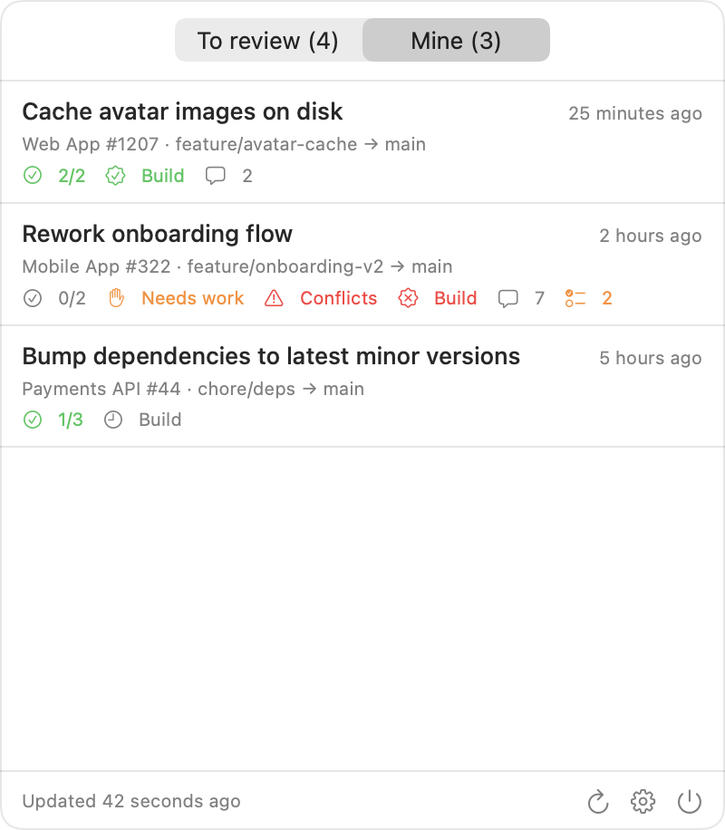

# PR Checker

A menu bar (macOS) and system tray (Windows) app for **Bitbucket Server / Data Center** that shows the pull requests waiting for your review and the status of the ones you opened, and notifies you when something changes.

- **To review**: open PRs where you're a reviewer and haven't approved. PRs you marked *needs work* come back once the author pushes new commits.
- **Mine**: your open PRs with approvals, needs-work, merge conflicts, build status, comments and open tasks.
- The menu bar or tray icon shows how many PRs wait for your review, plus a `•` when one of your own PRs needs attention.
- Click any PR or notification to open it in the browser.
- In English or Turkish, following your system language or chosen in Settings.

  <picture>
    <source media="(prefers-color-scheme: dark)" srcset="docs/screenshots/macos/menu-review-dark.png">
    
  </picture>
  <picture>
    <source media="(prefers-color-scheme: dark)" srcset="docs/screenshots/macos/menu-mine-dark.png">
    
  </picture>

macOS, with made-up data.

## Platforms

| | macOS | Windows |
|---|---|---|
| Status | Released | Released (tested on Windows 11, ARM64 and x64) |
| Requires | macOS 15 or later | Windows 10 (1809) or later |
| Built with | Swift, SwiftUI | C#, .NET 10, WinUI 3 |
| Updates | Automatic (Sparkle), signed and notarized | Automatic (Velopack); unsigned for now |
| Code | [`macos/`](macos) | [`windows/`](windows) |

Both need Bitbucket Server or Data Center and a personal **HTTP access token** with *Read* permission (Profile → Manage account → HTTP access tokens). Both apps follow the same rules, described in [docs/behavior.md](docs/behavior.md).

## Install

**macOS:** download `PR-Checker-<version>.zip` from [Releases](../../releases), unzip it and move **PR Checker** to Applications. Open it, enter your server URL and token in Settings, and click **Save & Connect**. The app checks for updates once a week and asks before installing; to check right away, use **Settings → About → Check for Updates**

**Windows:** from the latest **PR Checker for Windows** release on [Releases](../../releases), download the installer for your PC:
- `PRCheckerApp-win-x64-Setup.exe` for most PCs
- `PRCheckerApp-win-arm64-Setup.exe` for ARM PCs, e.g. Snapdragon laptops or Windows running on Apple Silicon

Run it. It's not code-signed yet, so Windows SmartScreen asks once: choose **More info → Run anyway**. It installs for your user only, with no admin rights needed, and starts the app. The first time, Settings opens on **Bitbucket**: enter your server URL and token, then click **Save & Connect**. The app checks for updates once a week and asks before installing; to check right away, use **Settings → About → Check for updates**. A portable zip is also attached to each release if you can't run installers.

## Notifications

| When | For |
|---|---|
| A PR is added to your review list | To review |
| A PR you marked needs work gets new commits | To review |
| Someone else comments or replies | Both lists |
| Someone approves or marks needs work | Mine |
| Merge conflicts appear or get resolved | Mine |
| The build fails, or a failed build passes again | Mine |
| The PR is merged or declined | Mine |

The operating system must also allow PR Checker's notifications. On macOS, that's System Settings → Notifications → PR Checker. If it doesn't allow them, Settings and the menu show a warning with a button that opens that page. Use **Send Test Notification** in Settings → General to check delivery. Click a notification to open its PR; close it to dismiss it.

Your own comments never notify you. Filters decide what gets announced, and changing a filter doesn't re-announce PRs the app already knew about. The first refresh after install or upgrade is silent.

## Settings

- **General:**
  - Notifications, with an option to hide PR details
  - Automation (macOS): run a command when a PR enters your review list or gets new commits, e.g. an automated pre-check. Values are passed as separate arguments, never through a shell.
  - Open at login
  - Refresh interval of 1–15 minutes. The app also refreshes after wake and when you open the list with stale data.
- **Bitbucket:**
  - Server URL and access token. They're saved only when **Save & Connect** succeeds.
  - **Sign Out**
  - Filters: hide drafts, and limit to project keys or `PROJECT/repo-slug` entries, comma-separated
- **About:** version and **Check for Updates**

## Privacy

PR Checker has no backend, accounts, analytics or telemetry. Your data stays on your computer and on your own Bitbucket server.
- Your token is kept in the macOS Keychain or Windows Credential Manager, and only ever sent to the server it was saved for.
- The app connects only to your Bitbucket server and, about once a week, to the update feed.
- **Report a Problem** pre-fills a GitHub issue with the app version, OS and language. Nothing is sent until you submit it yourself.

The full details are in the [Privacy Policy](PRIVACY.md): what's stored where, every connection, and how to remove everything.

## Legal

- **[Terms of Use](TERMS.md).** On Windows, these include Microsoft's license terms for the bundled Windows App SDK components. Both apps ask you to agree once, at first launch.
- **[Privacy Policy](PRIVACY.md)**
- **Third-party licenses:** included in each app under **Settings → About → Third-Party Licenses**. To regenerate them after changing a dependency, run `scripts/third-party-notices.py`.
- PR Checker isn't affiliated with or endorsed by Atlassian. Bitbucket is a trademark of Atlassian.

## Development

| | |
|---|---|
| [`macos/`](macos/README.md) | Mac app: build, test, release |
| [`windows/`](windows/README.md) | Windows app: build, test, release |
| [`docs/behavior.md`](docs/behavior.md) | Rules both apps implement: review list, notifications, security limits |
| [`shared/fixtures/`](shared/fixtures) | Sample Bitbucket responses used by both test suites |
| [`shared/localization/`](shared/localization) | Every user-facing string in English and Turkish; `generate.py` writes each app's typed `L10n` accessors |
| [`Design/`](Design) | Icon sources for both platforms |
| [`.github/workflows/`](.github/workflows) | CI: builds and tests both apps on every push |
| [`scripts/release-badge.sh`](scripts/release-badge.sh) | Sets a README release badge's version and link to a new release; called by the release scripts |

Releases are tagged and titled per platform: `macOS-v0.2.7` "PR Checker for macOS 0.2.7", `windows-v0.1.0` "PR Checker for Windows 0.1.0". The release scripts create the tag and the GitHub release, and open a pull request that points the badge at it, so the rule holds without manual steps. `main` only accepts changes through pull requests.

## License

[MIT](LICENSE)
